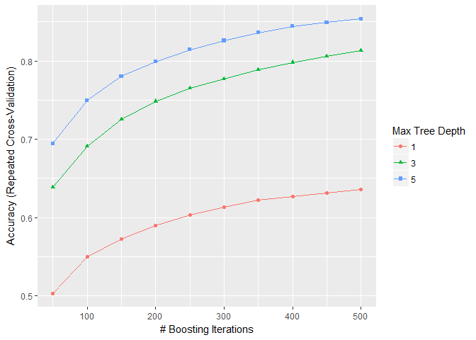

Human Activity Recognition
==========================
#### *Javier Carrasco*
#### *September 8th, 2017*

Summary
=======

The objective of this project is to investigate a model that predicts
the class of an activity from measurements collected using devices such
as Jawbone Up, Nike FuelBand, and Fitbite. The model is trained using
data from the [Human Activity Recognition
dataset](http://groupware.les.inf.puc-rio.br/har) and more specifically
data from accelerometers on the belt, forearm, arm and dumbell.

Data Analysis and Preparation
=============================

The HAR dataset contains device measurements that were collected asking
six young health participants to perform one set of 10 repetitions of
the Unilateral Dumbbell Biceps Curl in five different fashions: exactly
according to the specification (Class A), throwing the elbows to the
front (Class B), lifting the dumbbell only halfway (Class C), lowering
the dumbbell only halfway (Class D) and throwing the hips to the front
(Class E).

First, we load required libraries and the training and test sets:

    library(caret); library(gbm); library(plotmo); library(ggplot2)

    if (!file.exists("pml-training.csv")){
            fileURL <- "https://d396qusza40orc.cloudfront.net/predmachlearn/pml-training.csv"
            download.file(fileURL, "pml-training.csv", method="curl")
    }  
    if (!file.exists("pml-test.csv")){
            fileURL <- "https://d396qusza40orc.cloudfront.net/predmachlearn/pml-testing.csv"
            download.file(fileURL, "pml-test.csv", method="curl")
    }
    train = read.csv("pml-training.csv")
    train.classe = train$classe
    test = read.csv("pml-test.csv")

Training data contains 19622 observations of 160 variables including
device measurements and `classe`, the prediction outcome variable as a factor with 5 levels: A, B, C, D and E.

Next, we filter columns corresponding to accelerometer measurements on
the belt, forearm, arm and dumbel:

    filter = grepl("belt|arm|dumbell", names(train))
    train = train[, filter]
    train <- data.frame(sapply(train, as.numeric))
    test = test[, filter]
    test <- data.frame(sapply(test, as.numeric))

Finally, we pre-process the data with the `knnImpute` method to replace
missing values with the average value of the nearest-neighbors:

    preObj <- preProcess(x = train, method = c("knnImpute"))
    train <- data.frame(predict(preObj, train))
    test <- data.frame(predict(preObj, test))

Feature Selection
=================

To select features for the prediction model we apply the following
steps:

1.  Remove near zero variables:

        nzr = nearZeroVar(train, saveMetrics = T)    
        row.names(nzr[nzr$nzv == T,])    

        ##  [1] "kurtosis_roll_belt"     "kurtosis_picth_belt"   
        ##  [3] "kurtosis_yaw_belt"      "skewness_roll_belt"    
        ##  [5] "skewness_roll_belt.1"   "skewness_yaw_belt"     
        ##  [7] "max_yaw_belt"           "min_yaw_belt"          
        ##  [9] "amplitude_yaw_belt"     "kurtosis_roll_arm"     
        ## [11] "kurtosis_picth_arm"     "kurtosis_yaw_arm"      
        ## [13] "skewness_roll_arm"      "skewness_pitch_arm"    
        ## [15] "skewness_yaw_arm"       "kurtosis_roll_forearm" 
        ## [17] "kurtosis_picth_forearm" "kurtosis_yaw_forearm"  
        ## [19] "skewness_roll_forearm"  "skewness_pitch_forearm"
        ## [21] "skewness_yaw_forearm"   "max_yaw_forearm"       
        ## [23] "min_yaw_forearm"        "amplitude_yaw_forearm"

        train = train[, row.names(nzr[nzr$nzv == F,])]    
        test = test[, row.names(nzr[nzr$nzv == F,])]    
        print(paste("#features:", length(colnames(train))))    

        ## [1] "#features: 90"

2.  Remove variables which are highly correlated: Remove variables to
    reduce pair-wise correlations:

        highlyCor <- findCorrelation(cor(train), exact = F)
        colnames(train)[highlyCor]

        ##  [1] "max_picth_belt"          "min_roll_belt"          
        ##  [3] "min_pitch_belt"          "avg_roll_belt"          
        ##  [5] "accel_belt_x"            "accel_belt_z"           
        ##  [7] "var_pitch_arm"           "avg_yaw_arm"            
        ##  [9] "gyros_arm_y"             "max_roll_arm"           
        ## [11] "max_picth_arm"           "amplitude_pitch_arm"    
        ## [13] "var_roll_forearm"        "avg_pitch_forearm"      
        ## [15] "stddev_pitch_forearm"    "roll_belt"              
        ## [17] "stddev_roll_belt"        "stddev_pitch_belt"      
        ## [19] "max_roll_belt"           "amplitude_roll_belt"    
        ## [21] "stddev_yaw_belt"         "total_accel_belt"       
        ## [23] "stddev_pitch_arm"        "max_picth_forearm"      
        ## [25] "var_accel_forearm"       "amplitude_pitch_forearm"
        ## [27] "stddev_yaw_forearm"

        train <- train[ , - highlyCor[complete.cases(highlyCor)]]
        test <- test[ , - highlyCor[complete.cases(highlyCor)]]
        print(paste("#features:", length(colnames(train))))

        ## [1] "#features: 63"

3.  Apply PCA (Principal Component Analysis) and select those variables
    that capture 95% of the variance in the inputs:

        preObj <- preProcess(x = train, method = c("pca"))
        train <- data.frame(predict(preObj, train))
        test <- data.frame(predict(preObj, test))
        print(paste("#features:", length(colnames(train))))

        ## [1] "#features: 32"

After those steps the number of features is reduced from 160 to 32

Model Training
==============

First, we partition the train dataset into two sets, `inSample` with 70%
of the training data and `outSample` with the remaining 30%:

    train$classe = train.classe
    set.seed(123)
    split = createDataPartition(y = train$classe, p = .7, list = F)
    inSample = train[split,]
    outSample = train[-split,]

Next, we train our model using "Gradient Boost Method" (`gbm`) with
2-fold cross validation and 2 repeats. For this training we choose three
interaction depths (1, 3 and 5) and the maximum number of boosting
iterations is set to 500.

    control <- trainControl(method="repeatedcv", number=2, repeats=2)
    gbmGrid <-  expand.grid(interaction.depth = c(1, 3, 5),
                            n.trees = (1:10)*50,
                            shrinkage = 0.1,
                            n.minobsinnode = 10)
    model <- train(classe~., data=inSample, method="gbm", trControl=control, tuneGrid=gbmGrid)
    ggplot(model)

As it can be seen in the plot, the best performance is obtained when the
maximum tree depth is 5 and the number of boosting iterations is 500.
The plot also suggests that prediction's accuracy could be further
improved by increasing the maximum tree depth and the number of boosting
interactions.

The following plot shows the relative importante of each feature:

    importance = varImp(model, scale = TRUE)
    ggplot(importance)

The confusion matrix for `inSample` is:

    predictions <- predict(model, newdata = inSample)
    cnfM <- confusionMatrix(inSample$classe, predictions)
    cnfM

    ## Confusion Matrix and Statistics
    ## 
    ##           Reference
    ## Prediction    A    B    C    D    E
    ##          A 3879   11   11    5    0
    ##          B   38 2587   23    2    8
    ##          C    6   47 2325   15    3
    ##          D    1    3   41 2206    1
    ##          E    6    5   17    6 2491
    ## 
    ## Overall Statistics
    ##                                          
    ##                Accuracy : 0.9819         
    ##                  95% CI : (0.9795, 0.984)
    ##     No Information Rate : 0.2861         
    ##     P-Value [Acc > NIR] : < 2.2e-16      
    ##                                          
    ##                   Kappa : 0.9771         
    ##  Mcnemar's Test P-Value : 4.354e-09      
    ## 
    ## Statistics by Class:
    ## 
    ##                      Class: A Class: B Class: C Class: D Class: E
    ## Sensitivity            0.9870   0.9751   0.9619   0.9875   0.9952
    ## Specificity            0.9972   0.9936   0.9937   0.9960   0.9970
    ## Pos Pred Value         0.9931   0.9733   0.9704   0.9796   0.9865
    ## Neg Pred Value         0.9948   0.9940   0.9919   0.9976   0.9989
    ## Prevalence             0.2861   0.1931   0.1759   0.1626   0.1822
    ## Detection Rate         0.2824   0.1883   0.1693   0.1606   0.1813
    ## Detection Prevalence   0.2843   0.1935   0.1744   0.1639   0.1838
    ## Balanced Accuracy      0.9921   0.9844   0.9778   0.9917   0.9961

and the in-sample error is approximately 2%.

The confusion matrix for `outSample` is:

    predictions <- predict(model, newdata = outSample)
    cnfM <- confusionMatrix(outSample$classe, predictions)
    cnfM

    ## Confusion Matrix and Statistics
    ## 
    ##           Reference
    ## Prediction    A    B    C    D    E
    ##          A 1569   55   26   20    4
    ##          B   62  987   65    5   20
    ##          C   16  106  846   43   15
    ##          D   15   19   82  831   17
    ##          E   15   38   27   27  975
    ## 
    ## Overall Statistics
    ##                                          
    ##                Accuracy : 0.885          
    ##                  95% CI : (0.8765, 0.893)
    ##     No Information Rate : 0.285          
    ##     P-Value [Acc > NIR] : < 2.2e-16      
    ##                                          
    ##                   Kappa : 0.8544         
    ##  Mcnemar's Test P-Value : 1.515e-07      
    ## 
    ## Statistics by Class:
    ## 
    ##                      Class: A Class: B Class: C Class: D Class: E
    ## Sensitivity            0.9356   0.8191   0.8088   0.8974   0.9457
    ## Specificity            0.9750   0.9675   0.9628   0.9732   0.9780
    ## Pos Pred Value         0.9373   0.8665   0.8246   0.8620   0.9011
    ## Neg Pred Value         0.9744   0.9541   0.9588   0.9807   0.9883
    ## Prevalence             0.2850   0.2048   0.1777   0.1573   0.1752
    ## Detection Rate         0.2666   0.1677   0.1438   0.1412   0.1657
    ## Detection Prevalence   0.2845   0.1935   0.1743   0.1638   0.1839
    ## Balanced Accuracy      0.9553   0.8933   0.8858   0.9353   0.9618

and the out-of-sample error is approximately 11%.

Predictions
===========

Let us apply our prediction model to the 20 test cases:

    predictions = predict(model, newdata = test)
    predictions = mapvalues(predictions, from = c(1, 2, 3, 4, 5), to = c("A", "B", "C", "D", "E"))
    predictions

    ##  [1] B C C A A A D B A A C C B A B A A B D B
    ## Levels: A B C D E
